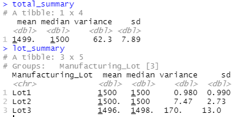

# MechaCar_Statistical_Analysis
AutosRU data analysis to review the suffering production data for insights that may help the manufacturing team.

## Purpose 
The purpose of this analysis is to observe and predict various car metrics through statistical analysis. The MechaCar is suffering from production troubles that are blocking the manufacturing team's progress. As a part of upper management, the data analytics team will review the production data on various attributes of the car to determine how the car can be measurably predicted. 

## Linear Regression to Predict MPG

The dataset contains mpg test results for 50 prototype MechaCars. The MechaCar prototypes were produced using multiple design specifications to identify ideal vehicle performance. Multiple metrics, such as vehicle length, vehicle weight, spoiler angle, drivetrain, and ground clearance, were collected for each vehicle. From using R, a linear model was created that predicts the mpg of MechaCar prototypes using several variables from the dataset. The output of this data is shown by the following:

Based on this image, there are variables/coefficients that provide a non-random amount of variance to the mpg values in the dataset. The smallest standard error in the linear regression can be attributed to the vehicle weight and spoiler angle. These factors therefore have less variance when it comes to determining the vehicle's MPG.

Considering the slope of the linear model. it can considered to be non-zero. If there is a significant linear relationship between the independent variable X and the dependent variable Y, the slope will not equal zero. This can be reasoned by following various methods of hypouthesis testing in statistics. The solution to this problem takes four steps: (1) state the hypotheses, (2) formulate an analysis plan, (3) analyze sample data, and (4) interpret results. Assume a 0.05 level of significance.

- State the hypotheses: The first step is to state the null hypothesis and an alternative hypothesis.
  - Ho: The slope of the regression line is equal to zero.

  - Ha: The slope of the regression line is not equal to zero.

- Formulate an analysis plan: For this analysis, the significance level is 0.05. Using sample data, a linear regression t-test was used to determine whether the slope of the regression line differs significantly from zero.

- Analyze sample data: To apply the linear regression t-test to sample data, it requires the standard error of the slope, the slope of the regression line, the degrees of freedom, the t statistic test statistic, and the P-value of the test statistic. Based on the t statistic test statistic and the degrees of freedom, we determine the P-value, which is 5.35e-11. 

- Interpret results: Since the P-value (5.35e-11. ) is much less than the significance level (0.05), we cannot accept the null hypothesis.

Does this linear model predict mpg of MechaCar prototypes effectively? This may be it's own experiment in and of itself to find out. The R-squared value is often a good indicator of fit. The current value of the multiple R-squared is 0.7149 and the adjusted R-squared is 0.6825. A 100% R-qsaured indicates that the model explains all the variability of the response data around its mean. In general, this model can reasonably predict the MPG of the MechaCar but it's not perfect.

## Summary Statistics on Suspension Coils

The MechaCar dataset contains the results from multiple production lots. In this dataset, the weight capacities of multiple suspension coils were tested to determine if the manufacturing process is consistent across production lots. Using R, a summary statistics table was created to show the suspension coil’s PSI continuous variable across all manufacturing lots, and the following PSI metrics for each lot: mean, median, variance, and standard deviation. These are shown below:

The design specifications for the MechaCar suspension coils dictate that the variance of the suspension coils must not exceed 100 pounds per square inch. The current manufacturing data does meet this design specification for all manufacturing lots in total and each lot individually.

In each case, the mean and the median are exact or very close which would illustrate a good distribution in the coil data of the sample size. However, in each case the variance is quite significantly different which can contribute to varied PSI readings.

## T-Tests on Suspension Coils

Using R, a series of t-tests were performed to determine if all manufacturing lots and each lot individually are statistically different from the population mean of 1,500 pounds per square inch. The same priciples apply that were previously discussed for determining if the slope of the model was zero. 

In stating the hypotheses, assuming a signifigance of 0.05, the null hypothesis and an alternative hypothesis are provided as follows:

    - Ho: The value of PSI is a mean of 1,500 PSI, not statistically different.

    - Ha: The value of PSI is a statistically different beyond 1500 PSI.

- All manufacturing lots

    Reference the image below for the summary statistics:
    

    - At a P-Value of 0.06, this fails to reject the null hypothesis and therefore not statistically different.

- Lot 1

    Reference the image below for the summary statistics:
    

    - At a P-Value of 1, this fails to reject the null hypothesis and therefore not statistically different.

- Lot 2

    Reference the image below for the summary statistics:
    

    - At a P-Value of 0.60, this fails to reject the null hypothesis and therefore not statistically different.

- Lot 3

    Reference the image below for the summary statistics:
    

    - At a P-Value of 0.04, it is acceptable to reject the null hypothesis and therefore the PSI is statistically different.

## Study Design: MechaCar vs Competition

